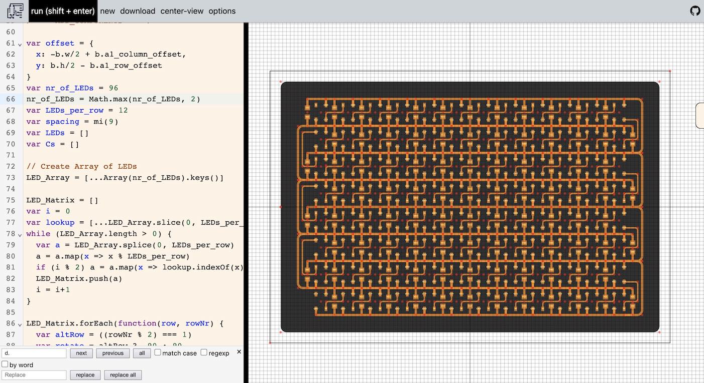

# RGB-Optogenetic

Illuminating a standard 96 plate well with 96 RGB LEDs.

Work in Progress, productions files and BoM to come.

Created with Leo McElroy's [SVG-PCB](http://leomcelroy.com/svg-pcb/)

